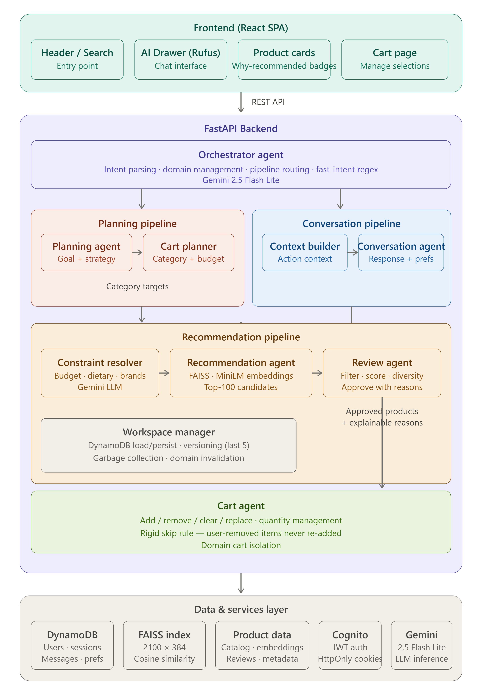

# Amazon AI Commerce Assistant 🛒🤖

> **Amazon HackOn 2025 — Reimagining Urgent Shopping**

---

## 📋 Problem Statement

**Amazon Now – Reimagining Urgent Shopping**

Quick-commerce customers are fundamentally different from traditional e-commerce customers. They often arrive with an immediate need and expect to complete their purchase within seconds, yet today's shopping experiences still rely heavily on search, browsing, and manual decision-making.

**How might we help customers discover, decide, and purchase what they need in the fastest and most effortless way possible?**

---

## 🌟 Inspiration

We noticed a fundamental gap in how people shop online today:

**The "I know what I want but not what to buy" problem.**

When someone says "I'm hosting a movie night" — they don't want to search for "chips", then "chocolate", then "drinks", then compare 50 options each, then manually check ingredients for allergies. They want someone to *just handle it*.

In physical stores, a knowledgeable store associate would ask: *"How many people? Any allergies? What's your budget?"* — and then walk you to the right aisle with 3-4 perfect picks.

**We built that associate for Amazon.**

Our inspiration came from:
- **Amazon Rufus** — the idea that AI can live inside the shopping experience
- **Personal shoppers** — the consultation-first approach (ask before you recommend)
- **Quick-commerce urgency** — customers want decisions made for them, not more options to browse
- **Multi-agent AI systems** — specialized agents that each do one thing well, orchestrated together

The result: a system where a 2-message conversation replaces 15 minutes of browsing, filtering, and manual decision-making.

---

## 💡 Our Solution

A next-generation AI shopping consultant (Rufus) that replaces the traditional "search → browse → decide → buy" loop with a **single natural language conversation**. The user tells the AI what they need, the system consults, retrieves, filters, and builds a curated cart — all in seconds.

> *"I'm planning a movie night for 4 people, under $50, no nuts"*
> → AI asks 1 question → builds a cart with chips, chocolate, drinks — all nut-free, within budget, with explainable reasons.

### How It Works (User Perspective)

| Step | What the User Does | What the System Does Behind the Scenes |
|------|-------------------|---------------------------------------|
| 1 | Opens Rufus and says "I'm planning a movie night for 4 people" | Orchestrator detects an event → ConversationAgent asks 1-2 quick preference questions |
| 2 | Answers: "Under $50, chips and chocolate, no nuts" | PlanningAgent extracts goal → CartPlanner creates category targets (snacks, drinks, chocolate) → ConstraintResolver normalizes "no nuts" → RecommendationAgent runs FAISS retrieval → ReviewAgent filters and scores → CartAgent builds the cart |
| 3 | Sees a curated shelf with "Why Recommended" badges | Products are displayed with explainable reasons ("Fits your budget", "Highly rated", "Nut-free") |
| 4 | Says "remove the expensive one" | Orchestrator identifies the highest-priced cart item and removes it |
| 5 | Says "tell me about the Hershey's product" | System retrieves full metadata + customer reviews, generates a conversational summary |
| 6 | Says "actually, switch to coffee instead" | Old shelf disappears, new domain created, fresh retrieval for coffee |

### What Makes It Different

| Traditional Amazon | Our System |
|-------------------|-----------|
| User searches, browses, filters manually | User describes their goal, AI handles the rest |
| No explanation why a product appears | Every product has a "Why Recommended" badge with real reasons |
| Cart is manual-only | AI builds a curated cart based on your conversation |
| No memory between sessions | System remembers your preferences across all sessions |
| One shopping goal at a time | Multiple simultaneous goals (movie night + gaming laptop) |
| Reviews are raw text you read yourself | AI summarizes reviews and answers questions about products |
| Decision fatigue from 1000s of options | 6-12 curated products, pre-filtered for YOUR constraints |

### Core Capabilities

1. **Consultative Shopping** — Asks questions before recommending. Gathers budget, dietary needs, brand preferences, group size.

2. **Goal-Based Cart Building** — Say "movie night" or "camping trip" and the system plans categories, retrieves per category, filters, and auto-builds a complete cart.

3. **Explainable AI Recommendations** — Every recommended product shows WHY it was chosen. Users trust the system because they see the reasoning.

4. **Constraint-Aware Filtering** — "No nuts", "under $30", "no Apple products" — constraints are enforced by the Review Agent at every recommendation cycle. Products that violate constraints are rejected with logged reasons.

5. **Natural Language Cart Operations** — "Remove the dog food", "add something to drink", "clear everything over $30" — all work through conversation.

6. **Multi-Domain Simultaneous Shopping** — Plan a birthday party AND shop for headphones at the same time. Each goal has its own shelf, cart, and workspace.

7. **Long-Term Shopping Memory** — Mention you're vegan once, and the system remembers across all future sessions. Confidence-scored memories with automatic extraction.

8. **Product Deep-Dive** — Ask about any product and get metadata, features, and actual customer review summaries retrieved from the dataset.

9. **Amazon-Native UI** — Full storefront experience with product cards, search, cart page, saved products, quantity selectors — all working alongside the AI assistant.

---

## 🏗️ Architecture



### Multi-Agent Pipeline

Our system uses a **6-agent orchestrated pipeline** where each agent has a single responsibility and strict output contracts. No agent can overstep its role:

```
User Goal → Orchestrator → Planning Agent → Cart Planner → Recommendation Agent → Review Agent → Cart Agent → User
                                                                        ↑
                                                              Constraint Resolver
```

| Agent | Technology | Role |
|-------|-----------|------|
| **Orchestrator** | Gemini LLM | Parses intent, routes to correct pipeline, manages domains |
| **Planning Agent** | Gemini LLM | Extracts event/goal, generates shopping strategy and assumptions |
| **Cart Planner** | Gemini LLM | Converts plan into category targets with budget allocation |
| **Recommendation Agent** | Pure Python + FAISS | Semantic vector search, returns top-100 candidates per category |
| **Constraint Resolver** | Gemini LLM | Normalizes dietary, budget, brand constraints into standard schema |
| **Review Agent** | Pure Python | Filters candidates against constraints, scores, approves with reasons |
| **Cart Agent** | Pure Python | Executes cart mutations, enforces rigid skip rule |
| **Conversation Agent** | Gemini LLM | Generates natural responses, extracts preferences, explains actions |

### Key Design Principle

> **The Conversation Agent NEVER makes decisions.** It only explains what other agents have already done. The Orchestrator owns routing. The Review Agent owns approval. The Cart Agent owns mutations.

---

## 🖥️ Screenshots

### AI Shopping Consultation


### Recommendation Shelf with Cart


---

## ⚙️ Tech Stack

| Layer | Technology | Why |
|-------|-----------|-----|
| **Frontend** | React + Tailwind CSS | Fast, responsive, component-based UI for an Amazon-like shopping experience |
| **Backend** | FastAPI + Python | High-performance async API with strong typing and automatic documentation |
| **AI** | Gemini 2.5 Flash Lite + Multi-Agent Architecture | Goal-driven shopping consultation through specialized agents for planning, recommendation, review, cart management, and conversation |
| **Vector Search** | FAISS + Embeddings (all-MiniLM-L6-v2) | Semantic product retrieval by matching user intent with product embeddings, enabling recommendations beyond keyword-based search |
| **Database** | DynamoDB | Stores user sessions, shopping plans, recommendation workspaces, carts, and long-term memory with highly scalable, low-latency access |
| **Storage** | Amazon S3 | Stores product datasets, embeddings, static assets, and future large-scale recommendation artifacts |
| **Infrastructure** | EC2 (Prototype) | Hosts the full-stack application during development and hackathon deployment |
| **Auth** | AWS Cognito | JWT verification, HttpOnly secure cookies, rate limiting |
| **Production Path** | CloudFront, API Gateway, ECS/Fargate, Redis, OpenSearch | Enables horizontal scaling, caching, distributed vector search, and high availability for millions of shopping sessions |

---

## 🚀 Key Features

### 1. Consultative AI Shopping (Conversation-First)
Unlike traditional recommendation engines that immediately dump products, our system **asks questions first**. When a user says "I'm planning a movie night", Rufus responds with:

> *"Sounds fun! How many people, and any snack preferences or dietary needs?"*

Only after gathering context does the system retrieve products. This ensures every recommendation is personalized from the start — not generic results filtered after the fact.

**How it works internally:**
- Orchestrator detects an event/goal → routes to `converse` action
- ConversationAgent asks 1-2 natural questions
- User provides preferences → state is updated
- Post-processing detects preferences are available → triggers the full pipeline

### 2. Goal-Based Cart Building
Users describe a shopping goal in natural language and the system builds a complete, category-balanced cart automatically:

- **"Movie night for 4"** → generates categories (snacks, drinks, accessories) → retrieves per category → filters → adds best product per category
- **"Camping trip this weekend"** → plans (food, gear, safety items) → curates and builds

The **Cart Planner** (LLM-powered) determines what categories are needed and allocates budget proportionally. The **Cart Agent** then fills each slot with the highest-scoring approved product.

### 3. Explainable Recommendations ("Why Recommended" Badges)
Every product displayed on the recommendation shelf carries a green badge explaining why it was chosen:

- ✅ "Fits your budget"
- ✅ "Highly rated"
- ✅ "One of your preferred brands"
- ✅ "Matches preference: organic"

These reasons come directly from the **Review Agent's** scoring logic — they're not AI-generated hallucinations, they're rule-based verifiable facts about why that product passed the filter.

### 4. Constraint-Aware Review Agent (Gatekeeper)
The Review Agent is a **pure Python rule engine** (no LLM) that evaluates every candidate product against:

| Constraint Type | Example | Action |
|----------------|---------|--------|
| Budget | "under $50" | Hard reject if price exceeds max |
| Dietary/Allergen | "no nuts" | Hard reject if title/reviews mention the allergen |
| Brand Avoidance | "no Apple" | Hard reject if brand matches |
| Negative Constraints | "no wired" | Hard reject if product matches |
| Diversity Guard | Too many of one brand | Penalize score by -50 (max 3 per brand) |

Products that pass all filters receive an **alignment score** (0-100) and **confidence score**. Only products scoring above the threshold (60) are approved with documented reasons.

### 5. Natural Language Cart Operations
Users can manipulate their cart through conversation without knowing product IDs or navigating UI:

| User Says | System Does |
|-----------|-------------|
| "Remove the expensive one" | Identifies highest-priced cart item, removes it |
| "Add something to drink" | Retrieves drinks, adds best match |
| "Clear everything over $30" | Finds and removes items exceeding $30 |
| "Remove the dog food" | Matches by title keyword, removes |
| "Add 3 of those chips" | Adds specific product with quantity |

The Orchestrator's `_find_cart_item_by_description()` method uses keyword matching against product titles, categories, brands, and price-based heuristics to identify which cart item the user is referring to.

### 6. Multi-Domain Simultaneous Shopping
Users can pursue **multiple shopping goals at the same time** without conflicts:

- "I'm planning a movie night" → creates `movie_night` domain
- "I also need a gaming laptop" → creates `gaming_laptop` domain (movie_night stays)
- Each domain has its own: recommendation workspace, cart workspace, and shelf on the homepage
- "Forget movie night" → only removes that domain, gaming laptop unaffected

This is powered by the `active_domains` list and domain-keyed workspaces in the `AgentExecutionContext`.

### 7. Long-Term Shopping Memory
The system automatically extracts and remembers persistent preferences:

- **Extraction**: After every state change, a background Gemini call analyzes the conversation for persistent facts ("user is vegan", "user hates Apple products")
- **Confidence Scoring**: Each memory gets a score (0-100). Only high-confidence (60+) memories are persisted.
- **Cross-Session**: Memories are stored in the DynamoDB User table, not the session. They apply to ALL future sessions.
- **Constraint Integration**: Remembered preferences are fed into the ConstraintResolver on every recommendation cycle.

### 8. Product Deep-Dive (Real Review Data)
When a user asks about a specific product, the system retrieves:

- Full metadata (title, brand, price, features, description)
- Customer review summaries (avg rating, positive/negative highlights)
- Actual review text excerpts from the 78MB reviews dataset

The ConversationAgent then generates a natural summary based on **real data**, not hallucinated facts.

### 9. Topic Switching (Dynamic Shelf Replacement)
When the user pivots to a new topic, the old shelf disappears and a new one appears:

- "Show me biscuits" → biscuits shelf appears
- "Actually, show me coffee instead" → biscuits shelf gone, coffee shelf appears with fresh products

The intent parser detects topic switches via `replace_active_domain` and triggers fresh FAISS retrieval for the new category.

### 10. Latency Optimizations
Every message goes through multiple agents, so we optimize aggressively:

| Optimization | Savings |
|-------------|---------|
| **Parallel DynamoDB reads** (messages + session simultaneously) | ~200ms |
| **Fast-intent detection** (regex skips Gemini for "hi", "yes", "clear cart") | ~800ms |
| **Background writes** (save messages + memory extraction after response) | ~300ms |
| **SentenceTransformer pre-loaded** at startup | ~3s on first query |
| **Pre-computed product details cache** (O(1) lookup per ASIN) | ~50ms per product |
| **Workspace versioning with GC** (prevents DynamoDB bloat) | Prevents slowdown over time |

---

## 🛠️ Quick Start Guide

### Prerequisites
- Python 3.10+
- Node.js 18+
- [Google Gemini API Key](https://aistudio.google.com/)
- AWS Account (for DynamoDB + Cognito)

### 1. Clone the Repository

```bash
git clone https://github.com/NOXious48/AI-commerce-assistant.git
cd AI-commerce-assistant
```

### 2. Backend Setup

```bash
# Create virtual environment
python -m venv venv

# Activate
.\venv\Scripts\activate       # Windows
# source venv/bin/activate    # Mac/Linux

# Install dependencies
pip install -r requirements.txt
```

### 3. Environment Variables

Create a `.env` file in the root directory:

```env
# AWS
AWS_REGION=us-east-1
AWS_ACCESS_KEY_ID=your-access-key
AWS_SECRET_ACCESS_KEY=your-secret-key

# Cognito
COGNITO_USER_POOL_ID=your-pool-id
COGNITO_CLIENT_ID=your-client-id
COGNITO_CLIENT_SECRET=your-client-secret

# DynamoDB Tables
DYNAMODB_USERS_TABLE=Users
DYNAMODB_SESSIONS_TABLE=ChatSessions
DYNAMODB_MESSAGES_TABLE=Messages
DYNAMODB_SAVED_PRODUCTS_TABLE=SavedProducts

# Google Gemini
GOOGLE_API_KEY=your-gemini-api-key
GOOGLE_API_KEY_ORCHESTRATOR=your-key
GOOGLE_API_KEY_CONVERSATION=your-key
GEMINI_MODEL=gemini-2.5-flash-lite

# Mode
DEMO_MODE=true
```

### 4. Start the Backend

```bash
python chat_agent.py
# → Server running at http://localhost:8000
```

### 5. Frontend Setup (Separate Terminal)

```bash
cd frontend
npm install

# For local development:
npm run dev
# → Running at http://localhost:5173

# For production build (served by FastAPI):
echo "VITE_DEMO_MODE=true" > .env
npm run build
# → Built to frontend/dist/, served at http://localhost:8000
```

### 6. Access the App

| Mode | URL | Notes |
|------|-----|-------|
| Development | `http://localhost:5173` | Vite dev server, proxies API to :8000 |
| Production | `http://localhost:8000` | FastAPI serves both frontend + API |
| EC2 Deployment | `http://your-ec2-ip:8000` | Full app from single instance |

---

## 🔒 Security

- **JWT Verification**: All API routes protected by Cognito JWT (JWKS with 24h cache)
- **Secure Tokens**: Access tokens in memory, refresh tokens in HttpOnly + Secure + SameSite=strict cookies
- **Data Isolation**: All DynamoDB queries enforce `user_id` from verified JWT — users can only access their own data
- **Rate Limiting**: Auth endpoints rate-limited by IP (3-5 requests per minute)
- **Agent Guardrails**: AI agents output structured JSON only — no code execution, no system access
- **Demo Mode**: `DEMO_MODE=true` bypasses auth for local testing without exposing credentials

---

## 📁 Project Structure

```
├── chat_agent.py                  # FastAPI entry point + static file serving
├── agents/
│   ├── orchestrator.py            # Central routing + domain management
│   ├── planning_agent.py          # Goal/event extraction (LLM)
│   ├── cart_planner.py            # Category target generation (LLM)
│   ├── recommendation_agent.py    # FAISS semantic retrieval
│   ├── review_agent.py            # Constraint filtering + scoring
│   ├── cart_agent.py              # Cart mutation logic
│   ├── conversation_agent.py      # Response generation (LLM)
│   ├── action_context_builder.py  # Context compression for LLM
│   ├── workspace_manager.py       # DynamoDB persistence + GC
│   └── models.py                  # All Pydantic schemas
├── services/
│   ├── retrieval_service.py       # Vector search + product cache
│   └── constraint_resolver.py     # Constraint normalization (LLM)
├── routers/
│   ├── chat_router.py             # Chat endpoints + orchestration
│   ├── cart_router.py             # Direct cart manipulation
│   ├── recommendation_router.py   # Shelves, search, home recs
│   └── user_router.py             # Profile, preferences, saved items
├── auth/
│   ├── router.py                  # Cognito auth endpoints
│   ├── cognito_service.py         # Boto3 Cognito wrapper
│   └── jwt_verifier.py            # JWKS verification
├── db/
│   └── dynamo_service.py          # DynamoDB data access layer
├── data/
│   ├── embedding/                 # embeddings.npy (2100x384) + id_mapping.json
│   ├── product-data/              # products_catalog.json
│   ├── products_metadata/         # products_metadata.json
│   └── products_reviews/          # review_summaries.json + products_reviews.json
├── frontend/
│   └── src/
│       ├── components/            # ProductCard, AIAssistantDrawer, RecommendationShelf
│       ├── context/               # AuthContext, CartContext, PageContext
│       └── pages/                 # Home, SearchPage, ProductDetail, Cart
├── tests/                         # Integration tests for the full pipeline
├── images/                        # Architecture diagram + screenshots
├── ARCHITECTURE.md                # Detailed system architecture document
└── README.md                      # This file
```

---

## 🎯 Amazon HackOn 2025

Built for **Amazon HackOn 2025** — Problem Statement: *Amazon Now – Reimagining Urgent Shopping*.

**Team**: AI Commerce Assistant

---

## 📄 License

MIT
