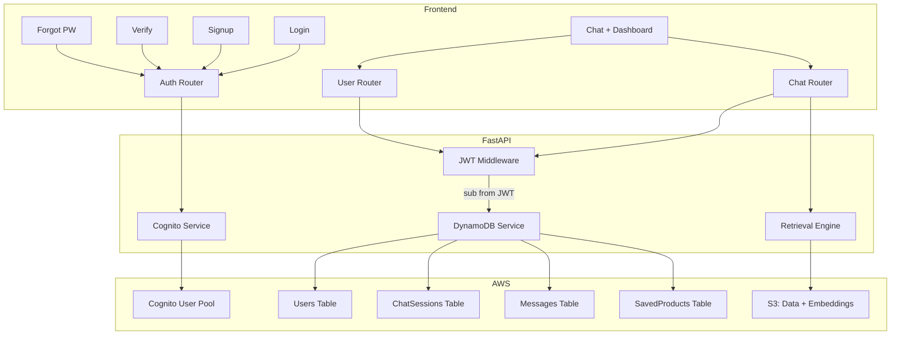

# AWS Cognito Authentication — Final Implementation Plan (v3)

## Summary of All Changes

| Version | Changes |
|---------|---------|
| v1 | Initial plan |
| v2 | HttpOnly cookies, manual Cognito, DynamoDB, JWT-only identity |
| **v3 (final)** | UUID sessions, SavedProducts table, preferences schema, CORS lock, memory from Messages, new-session API |

---

## Architecture



### Token Flow

```
LOGIN: Browser → POST /api/auth/login → Cognito → FastAPI
       FastAPI → Browser: {access_token, id_token} in body
       FastAPI → Browser: refresh_token in HttpOnly cookie

CHAT:  Browser → POST /api/chat (Authorization: Bearer <access_token>)
       FastAPI → verify JWT → extract sub → query DynamoDB → respond

REFRESH: Browser → POST /api/auth/refresh (cookie auto-sent)
         FastAPI → read cookie → Cognito → new access_token → Browser
```

---

## AWS Console Setup (Manual — Do Before Coding)

### Cognito User Pool

1. AWS Console → Cognito → **Create User Pool**
2. Sign-in: **Email only**
3. Password: Min 8, uppercase, lowercase, number, symbol
4. MFA: **Optional** (not enforced)
5. Recovery: Email
6. Self-signup: Enabled
7. Email: Cognito default
8. Required attributes: `email`, `name`
9. Pool name: `ai-commerce-users`
10. App client: Public, name `ai-commerce-web`
11. Auth flows: `ALLOW_USER_PASSWORD_AUTH`, `ALLOW_REFRESH_TOKEN_AUTH`
12. Tokens: Access=1h, ID=1h, Refresh=30d
13. **No client secret**

→ Note `USER_POOL_ID` and `CLIENT_ID`

### DynamoDB Tables (4 Core Tables)

**Table 1: `Users`**
| Key | Type | Example |
|-----|------|---------|
| `user_id` (PK) | String | `cognito-sub-uuid` |

Schema:
```json
{
  "user_id": "cognito_sub",
  "email": "user@example.com",
  "full_name": "John Doe",
  "created_at": "2026-06-14T10:00:00Z",
  "preferences": {
    "dietary_preferences": [],
    "favorite_categories": [],
    "preferred_brands": [],
    "allergens": [],
    "price_range": {"min": 0, "max": 50}
  }
}
```

**Table 2: `ChatSessions`**
| Key | Type | Example |
|-----|------|---------|
| `PK` (Partition) | String | `USER#abc123` |
| `SK` (Sort) | String | `SESSION#<uuid>` |

```json
{
  "PK": "USER#abc123",
  "SK": "SESSION#550e8400-e29b-41d4-a716-446655440000",
  "session_id": "550e8400-e29b-41d4-a716-446655440000",
  "title": "Protein Snacks Discussion",
  "created_at": "2026-06-14T10:00:00Z",
  "updated_at": "2026-06-14T10:05:00Z"
}
```

**Table 3: `Messages`**
| Key | Type | Example |
|-----|------|---------|
| `PK` (Partition) | String | `SESSION#<uuid>` |
| `SK` (Sort) | String | `MSG#2026-06-14T10:00:00.000Z` |

```json
{
  "PK": "SESSION#550e8400-...",
  "SK": "MSG#2026-06-14T10:00:00.000Z",
  "role": "user",
  "content": "Suggest healthy snacks",
  "products": []
}
```

**Table 4: `SavedProducts`**
| Key | Type | Example |
|-----|------|---------|
| `PK` (Partition) | String | `USER#abc123` |
| `SK` (Sort) | String | `PRODUCT#B01XXXXXX` |

```json
{
  "PK": "USER#abc123",
  "SK": "PRODUCT#B01MG8EFZH",
  "parent_asin": "B01MG8EFZH",
  "saved_at": "2026-06-14T10:00:00Z"
}
```

**Optional Future: `RecommendationHistory`** (not built now, documented for later)

All tables: **On-demand capacity mode**.

### Update `.env`

```env
AWS_REGION=us-east-1
COGNITO_USER_POOL_ID=us-east-1_XXXXXXXXX
COGNITO_CLIENT_ID=xxxxxxxxxxxxxxxxxxxxxxxxxx
DYNAMODB_USERS_TABLE=Users
DYNAMODB_SESSIONS_TABLE=ChatSessions
DYNAMODB_MESSAGES_TABLE=Messages
DYNAMODB_SAVED_PRODUCTS_TABLE=SavedProducts
```

---

## File-by-File Implementation

### 1. Auth Package

#### [NEW] auth/__init__.py
Empty init.

#### [NEW] auth/cognito_service.py
Boto3 Cognito wrapper:
- `signup(email, password, full_name)`
- `confirm_signup(email, code)`
- `resend_confirmation_code(email)`
- `login(email, password)` → `{access_token, id_token, refresh_token}`
- `refresh_tokens(refresh_token)` → `{access_token, id_token}`
- `forgot_password(email)`
- `confirm_forgot_password(email, code, new_password)`
- `get_user(access_token)`
- `global_sign_out(access_token)`

Error mapping: generic messages to prevent account enumeration.

#### [NEW] auth/jwt_verifier.py
- Downloads + caches Cognito JWKS
- `verify_token(token)` → claims dict
- FastAPI dependency: `get_current_user(request)` → `{"sub", "email", "name"}`
- Validates `iss`, `aud`, `exp`, `token_use`

#### [NEW] auth/router.py
| Endpoint | Auth | Cookie | Purpose |
|----------|------|--------|---------|
| `POST /api/auth/signup` | Public | — | Register + create DynamoDB user |
| `POST /api/auth/confirm` | Public | — | Verify email OTP |
| `POST /api/auth/login` | Public | Set refresh_token | Login |
| `POST /api/auth/refresh` | Cookie | Update refresh_token | Silent refresh |
| `POST /api/auth/forgot-password` | Public | — | Send reset code |
| `POST /api/auth/reset-password` | Public | — | Reset password |
| `POST /api/auth/resend-code` | Public | — | Resend OTP |
| `GET /api/auth/me` | JWT | — | Current user info |
| `POST /api/auth/logout` | JWT | Clear cookie | Global sign out |

Cookie config:
```python
httponly=True, secure=False,  # True in prod
samesite="strict", max_age=30*24*3600,
path="/api/auth"  # only sent to auth endpoints
```

#### [NEW] auth/rate_limiter.py
In-memory rate limiter. Production note: migrate to Redis/ElastiCache.
- Login: 5 req/min/IP
- Signup: 3 req/min/IP
- Forgot password: 3 req/min/IP

---

### 2. DB Package

#### [NEW] db/__init__.py
Empty init.

#### [NEW] db/dynamo_service.py

```python
class DynamoService:
    # --- Users ---
    create_user(user_id, email, full_name)
    get_user(user_id)
    update_preferences(user_id, preferences: dict)
    get_preferences(user_id)

    # --- Chat Sessions (UUID-based) ---
    create_session(user_id, session_id: str, title: str)
    list_sessions(user_id) -> list  # sorted by updated_at desc
    get_session(user_id, session_id) -> dict
    update_session_title(user_id, session_id, title)
    delete_session(user_id, session_id)

    # --- Messages ---
    save_message(session_id, role, content, products=[])
    get_messages(session_id, limit=50) -> list
    delete_session_messages(session_id)  # cascade delete

    # --- Saved Products ---
    save_product(user_id, parent_asin)
    unsave_product(user_id, parent_asin)
    list_saved_products(user_id) -> list
    is_product_saved(user_id, parent_asin) -> bool
```

All methods use `user_id` from JWT `sub`. Never from frontend.

---

### 3. Routers

#### [NEW] routers/user_router.py

All protected via `get_current_user`.

| Endpoint | Purpose |
|----------|---------|
| `GET /api/user/profile` | Get user from Users table |
| `GET /api/user/preferences` | Get preferences |
| `PUT /api/user/preferences` | Update preferences (validated schema) |
| `GET /api/user/saved-products` | List saved products |
| `POST /api/user/saved-products` | Save a product |
| `DELETE /api/user/saved-products/{asin}` | Unsave |

Preferences schema enforced:
```python
class UserPreferences(BaseModel):
    dietary_preferences: List[str] = []
    favorite_categories: List[str] = []
    preferred_brands: List[str] = []
    allergens: List[str] = []
    price_range: dict = {"min": 0, "max": 50}
```

#### [NEW] routers/chat_router.py

All protected via `get_current_user`.

| Endpoint | Purpose |
|----------|---------|
| `POST /api/chat/new-session` | Create session with `uuid4()`, return `{session_id}` |
| `POST /api/chat` | Send message to session, save to DynamoDB, return AI response |
| `GET /api/chat/history` | List user's sessions (sorted by last update) |
| `GET /api/chat/session/{id}` | Get messages for a session |
| `DELETE /api/chat/session/{id}` | Delete session + cascade messages |
| `POST /api/chat/reset` | Reset in-memory Gemini chat for session |

Chat flow:
1. Frontend calls `POST /api/chat/new-session` → gets `session_id`
2. Sends `POST /api/chat {session_id, message}`
3. Backend: verify JWT → extract `sub` → verify session belongs to user
4. Save user message to Messages table
5. Retrieve products + call Gemini
6. Save AI response + products to Messages table
7. Update session `updated_at` + auto-generate title from first message
8. Return `{reply, products}`

---

### 4. Main App

#### [MODIFY] chat_agent.py

- Mount `auth.router`, `routers.user_router`, `routers.chat_router`
- Remove inline `/api/chat` (moved to chat_router)
- Export `ChatSessionManager` and `SYSTEM_PROMPT` for import
- Serve auth pages: `/login`, `/signup`, `/verify`, `/forgot-password`
- Root `/` → serve chat_ui.html (auth guard handled client-side)
- Keep `/api/image-proxy` public
- **CORS restricted**: `["http://localhost:8000", "http://localhost:3000"]`

---

### 5. Frontend

#### [NEW] static/auth.js

```javascript
const Auth = {
    _accessToken: null,   // memory only
    _idToken: null,       // memory only
    _user: null,          // decoded from id_token

    setTokens(access, id) { /* store in memory, decode user */ },
    getAccessToken()      { /* return _accessToken */ },
    getUserInfo()         { /* return _user: {sub, email, name} */ },
    isAuthenticated()     { /* check token exists + not expired */ },

    async refreshTokens() {
        // POST /api/auth/refresh — HttpOnly cookie sent auto
        // On success: setTokens(response.access_token, response.id_token)
        // On failure: redirect to /login
    },

    async authFetch(url, opts) {
        // Add Authorization: Bearer header
        // If 401 → try refresh → retry once
    },

    async logout() {
        // POST /api/auth/logout → clear memory → redirect /login
    },

    async init() {
        // On page load: try silent refresh
        // If success: user is logged in
        // If fail: redirect to /login (on protected pages)
    }
};
```

#### [NEW] static/login.html
- Dark premium theme (matches chat_ui.html)
- Email + password, "Remember Me", "Forgot Password?" link
- Loading spinner, inline errors
- On load: `Auth.init()` → auto-redirect if logged in

#### [NEW] static/signup.html
- Full name, email, password, confirm password
- Password strength meter (4 bars)
- Live password rules checklist (8+ chars, uppercase, lowercase, number, symbol)
- On success → redirect to `/verify?email=...`

#### [NEW] static/verify.html
- 6 individual OTP inputs with auto-advance
- Resend code with 60s countdown
- On success → redirect to `/login`

#### [NEW] static/forgot_password.html
- Step 1: email → send code
- Step 2: OTP + new password + confirm
- Password strength meter
- On success → redirect to `/login`

#### [MODIFY] static/chat_ui.html
- Import `auth.js`
- Auth guard: `Auth.init()` → redirect if not logged in
- User dropdown in header (name, email, logout)
- Chat history sidebar (from `/api/chat/history`)
- "New Chat" button → `POST /api/chat/new-session`
- All API calls use `Auth.authFetch()`
- Session ID from `new-session` endpoint (not from cognito sub)

---

### 6. Config

#### [MODIFY] requirements.txt
Add: `boto3`, `python-jose[cryptography]`, `httpx`

#### [MODIFY] .env
Add Cognito + DynamoDB config vars

---

## File Summary

| # | File | Action |
|---|------|--------|
| 1 | `auth/__init__.py` | NEW |
| 2 | `auth/cognito_service.py` | NEW |
| 3 | `auth/jwt_verifier.py` | NEW |
| 4 | `auth/router.py` | NEW |
| 5 | `auth/rate_limiter.py` | NEW |
| 6 | `db/__init__.py` | NEW |
| 7 | `db/dynamo_service.py` | NEW |
| 8 | `routers/user_router.py` | NEW |
| 9 | `routers/chat_router.py` | NEW |
| 10 | `static/auth.js` | NEW |
| 11 | `static/login.html` | NEW |
| 12 | `static/signup.html` | NEW |
| 13 | `static/verify.html` | NEW |
| 14 | `static/forgot_password.html` | NEW |
| 15 | `chat_agent.py` | MODIFY |
| 16 | `static/chat_ui.html` | MODIFY |
| 17 | `.env` | MODIFY |
| 18 | `requirements.txt` | MODIFY |

---

## Security Summary

| Area | Approach |
|------|----------|
| Refresh token | HttpOnly, Secure, SameSite=Strict cookie |
| Access token | JS memory only, never persisted |
| Identity | Always from JWT `sub`, never frontend |
| Data ownership | All queries scoped to authenticated user |
| Passwords | Cognito-managed |
| JWT verify | JWKS, check iss/aud/exp/token_use |
| Rate limiting | In-memory (MVP), Redis (production) |
| CORS | Restricted origins, not `*` |
| Account enumeration | Generic error messages |
| Secrets | `.env` (MVP), AWS Secrets Manager (production) |
| MFA | Ready, not enforced |
| Session IDs | UUID per conversation, not cognito sub |

---

## Execution Order

1. `auth/` package (cognito_service → jwt_verifier → rate_limiter → router)
2. `db/` package (dynamo_service)
3. `routers/` (user_router → chat_router)
4. `chat_agent.py` update (mount routers, serve pages)
5. `static/auth.js` (shared frontend auth)
6. Auth pages (login → signup → verify → forgot_password)
7. `chat_ui.html` update (auth guard, history, user menu)
8. End-to-end testing
